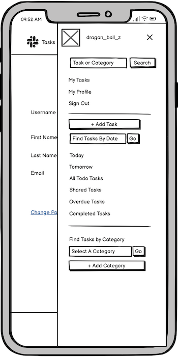
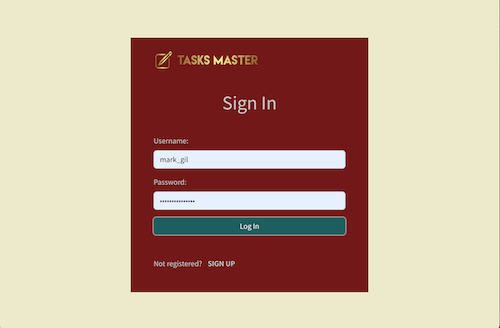
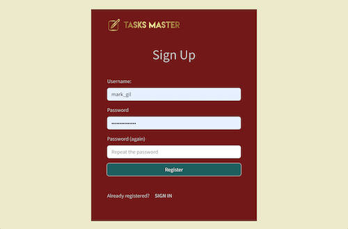
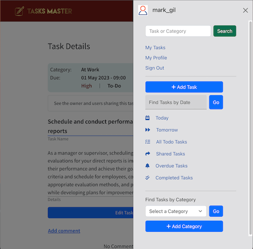
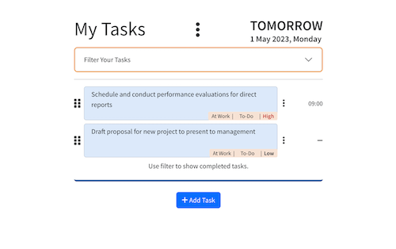
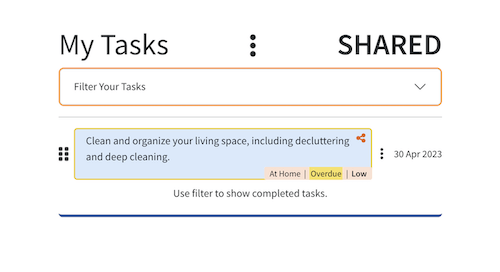
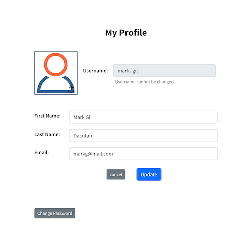
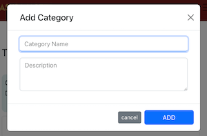

# Tasks Master

     

Tasks Master is a React application website that is designed and developed to help users in the management of their tasks - be it professional, domestic, or others. Its functionalities are also designed to enhance the efficiency of collaboration as it allows the sharing of tasks with other users. This site provides a simple and intuitive platform for users to manage their tasks. They can create multiple tasks, categorize them, set due dates/times, and assign a priority level for each task. Comments on a task can also be posted by users who are sharing the task.
The timezone used on this site is specifically 'Europe/Dublin'.
[View Live Website.](https://tasks-master.herokuapp.com)

## TABLE OF CONTENTS
* [**User Experience Design (UXD)**](#user-experience-design-uxd)
    * [**Strategy**](#strategy)
        * [Main Goal](#main-goal)
        * [Target Audience](#target-audience)
        * [The Use of Agile Methodology](#the-use-of-agile-methodology)
        * [EPICS](#epics)
    * [**Scope**](#scope)
        * [Planned Features / User Stories](#planned-features--user-stories)
        * [Design Choice](#design-choice)
    * [**Skeleton**](#skeleton)
        * [Wireframes](#wireframes)
    * [**Surface**](#surface)
* [**Features**](#features)
* [**Features for Future Implementation**](#features-left-for-future-implementation)
* [**Fixed Bugs**](#fixed-bugs)
* [**Testing**](#testing)
* [**Deployment**](#deployment)
* [**Technologies**](#technologies)
* [**Credits**](#credits)
* [**Acknowledgment**](#acknowledgment)

## User Experience Design (UXD)

### **STRATEGY**

#### **Main Goal:**
The main goal of this site is to aid users in managing and organizing their day-to-day tasks and foster efficient collaboration with other users. Overall, this is a productivity application that seeks to help users manage their everyday life.

#### **Target Audience:**
* People (young and old) who can use computers or mobile phones
* People who want to manage their time, and their daily tasks
* People who would like to collaborate with their tasks
* People who love to set goals and plan ahead

#### **The Use of Agile Methodology**
Using the Agile Methodology, the development of the project began with the creation of seven (7) EPICS to provide a framework for the website's design and structure. Each EPIC is comprised of multiple User Stories that detailed the project's features. A total of 35 User Stories were formulated for the Front-End, out of which 33 were successfully implemented, while the remaining 2 were deferred for future implementation. The 33 User Stories were distributed among four iterations, each with a distinct timeline due to the creator's other work commitments.

A story point (ranging from 2-8) and priority label (Must-Have, Should-Have, Could-Have, and Won’t-Have) were assigned to each User Story to guide the estimation of time needed for implementation and prioritize the most vital components of the site. Acceptance criteria were included in each User Story, which served as a basis for determining successful implementation. Tasks were also specified for the creator to fulfill the acceptance criteria. 

Github’s Kanban board is a very useful tool that this project used. Here is the link for the project’s Kanban board: [**Tasks Master Kanban**](https://github.com/users/marked-gil/projects/17)

[<ins>Back to Table of Contents</ins>](#table-of-contents)

#### **EPICS:**
* [Initial Project Setup](https://github.com/marked-gil/tasks-master-react/issues/1)
* [Profiles](https://github.com/marked-gil/tasks-master-react/issues/2)
* [Tasks](https://github.com/marked-gil/tasks-master-react/issues/3)
* [Categories](https://github.com/marked-gil/tasks-master-react/issues/4)
* [Comments](https://github.com/marked-gil/tasks-master-react/issues/5)
* [Authentication and Authorization](https://github.com/marked-gil/tasks-master-react/issues/6)
* [Navigation](https://github.com/marked-gil/tasks-master-react/issues/7)

[<ins>Back to Table of Contents</ins>](#table-of-contents)

### **SCOPE**

#### **Planned Features / User Stories**
The following are the User Stories that guided the creation of this React app:

* **User Story:** [React App Creation & Initial Heroku Deployment](https://github.com/marked-gil/tasks-master-react/issues/8)
    > As a developer, I can initially set up the React app and deploy it to Heroku, so that I can start building the application.

    Implementation:
    * Create the react app using npx create-react-app . --use-npm
    * Create app in Heroku and deploy

* **User Story:** [Front-end Framework Use](https://github.com/marked-gil/tasks-master-react/issues/9)
    > As a developer, I can use React-Bootstrap as a front-end framework, so that building this project will be quicker.

    Implementation:
    *  Install React-Bootstrap is installed and ready to use.
    * Add the React-Bootstrap CSS link on the of index.html
    * In the index.html, add crossorigin attribute with use-credentials value in the manifest import - to remove the console error

* **User Story:** [Sign Up](https://github.com/marked-gil/tasks-master-react/issues/37)
    > As a user, I can register on the site, so that I can access and utilize its capability.

    Implementation:
    *  Create a Sign-Up page that requests for username, and password (2x).
    * Add a ‘Register’ button that will submit the username and password provided by the new user.
    * Add a SIGN-IN link that will redirect to the Sign-In page
    * Username should be validated
    * Password should be validated
    * Add logo and app name

* **User Story:** [Sign In](https://github.com/marked-gil/tasks-master-react/issues/38)
    > As a user, I can log in to the site, so that I can access it and utilize its capability.

    Implementation:
    * Create Sign-In page with a form that requests for username and password
    * Add a Login button to submit the inputted username and password
    * Add the ‘Forgot Password’ link which redirects to the ‘Reset Password’ page
    * Add a ‘Sign Up’ link which redirects to the ‘Sign Up Page’
    * Username should be validated
    * Password should be validated
    * Add logo and app name

* **User Story:** [Nav Bar](https://github.com/marked-gil/tasks-master-react/issues/40)
    > As a user, I can see a navigation bar, so that I can easily and efficiently navigate through the website.

    Implementation:
    *  Create a nav bar with the following elements: logo and app name, search bar and button, nav menu, and user avatar.
    * Create a nav menu with the following elements: My Tasks, My Profile and Sign Out.
    * Make the nav bar only available when the user is signed in. The Sign-In and Registration page will have no nav bar.
    * Make the nav bar available on all pages except on the ‘Sign-In’ and Registration pages.

* **User Story:** [Side Bar](https://github.com/marked-gil/tasks-master-react/issues/41)
    > As a user, I can have easy access to the most useful menu items, so that the site can easily be navigated.

    Implementation:
    * Create a sidebar with the following links/buttons: ‘Add Task‘, ‘Today’, ‘Tomorrow’, ‘All My Tasks’, ‘Shared Tasks’, ‘Overdue Tasks’, the categories, and ‘add new category icon’, and ‘recently completed tasks’.
    * In large screen devices, keep the sidebar always present.
    * In small screen devices, such as mobile devices, including the contents of the sidebar as part of the off-canvas that appears when the burger menu is tapped.

* **User Story:** [Profile Page](https://github.com/marked-gil/tasks-master-react/issues/10)
    > As a user, I can update my profile details, so that I can make corrections or provide updated profile information.

    Implementation:
    * Create a Profile page template
    * Add a form that includes username, first name, last name, and email.
    * Make the username input field read-only.
    * Add ‘cancel’ and ‘update’ button
    * Create a ‘Change Password' link
    * Validate any change in the first name, and display feedback message as appropriate
    * Validate any change in the last name, and display feedback message as appropriate
    * Validate any change in Email, and display a feedback message as appropriate

* **User Story:** [My Tasks TODAY (Home) Page](https://github.com/marked-gil/tasks-master-react/issues/11)
    > As a user, I can view my tasks for today, so that I can work on each task, make updates, mark them as complete, delete them if necessary, and add more tasks for the day.

    Implementation:
    * Create 'My Tasks Today' template
    * List all tasks for the current date
    * Add delete and view buttons
    * Allow the setting of a task as ‘complete’ by the user

* **User Story:** [Filtering of My Tasks Today](https://github.com/marked-gil/tasks-master-react/issues/12)
    > As a user, I can filter my tasks for the current day, so that it is easy to organize and find tasks.

    Implementation:
    * Allow re-ordering of the list by ‘priority’, ‘due time’
    * Allow filtering of the list by 'progress', and 'category'
    * By default, only show ‘to-do’, ‘overdue’, and ‘shared’ tasks and order by due_time

* **User Story:** [My Tasks TOMORROW Page](https://github.com/marked-gil/tasks-master-react/issues/13)
    > As a user, I can view my tasks for tomorrow, so that I can work on each task, make updates, mark as complete, delete if necessary, and add more tasks for tomorrow.

    Implementation:
    * Create My Tasks Tomorrow template
    * List all tasks for tomorrow
    * Add 'delete' and 'view' button
    * Allow setting of the task as ‘complete’ by the user

* **User Story:** [Filtering of My Tasks Tomorrow](https://github.com/marked-gil/tasks-master-react/issues/14)
    > As a user, I can filter my tasks for tomorrow, so that it is easy to organize and find tasks.

    Implementation:
    * Allow re-ordering of the list by ‘priority’, and ‘due time’
    * Allow filtering of the list by 'progress', and 'category'
    * By default, only show 'to-do’ tasks and order by due_time

* **User Story:** [My ALL TODO Tasks Page](https://github.com/marked-gil/tasks-master-react/issues/21)
    > As a user, I can view the todo tasks, so that I can see all my upcoming tasks, and have a link to each tasks page that I want to view.

    Implementation:
    * Create ‘My All Tasks’ template
    * Have a link that will redirect to the 'My Task on a Specific Date' page
    * Add ‘add task’ button on each date

* **User Story:** [Filtering of Tasks in ‘My All TO-DO Tasks’ Page](https://github.com/marked-gil/tasks-master-react/issues/22)
    > As a user, I can filter all my tasks, so that it is easy to organize and find tasks.

    Implementation:
    * Allow re-ordering of the list of to-do tasks and priority
    * Allow filtering of the list by category
    * By default, show all todo tasks in ascending order based on due dates

* **User Story:** [My Tasks on SPECIFIC DATE Page](https://github.com/marked-gil/tasks-master-react/issues/15)
    > As a user, I can view my tasks for a specific date, so that I can work on each task, make updates, mark them as complete, delete them if necessary, and add more tasks.

    Implementation:
    * Create My Tasks Tomorrow template
    * List all tasks for tomorrow
    * Add 'delete', 'view', and 'done' button
    * Allow setting of the task as ‘complete’ by the user

* **User Story:** [Filtering of My Tasks on Specific Date](https://github.com/marked-gil/tasks-master-react/issues/16)
    > As a user, I can filter my tasks on a specific date, so that it is easy to organize and find tasks.

    Implementation:
    * Allow re-ordering of the list by ‘priority’, and ‘due time’
    * Allow filtering of the list by ‘progress’ and 'category'
    * By default, only show ‘to-do’ and ‘shared’ tasks and order by due_time

* **User Story:** [My SHARED Tasks Page](https://github.com/marked-gil/tasks-master-react/issues/17)
    > As a user, I can view my shared tasks (tasks I shared and tasks shared with me), so that I can work on each task, make updates, mark them as complete, and delete them if necessary.

    Implementation:
    * Create ‘My Shared Tasks’ template
    * List my shared tasks
    * Add 'delete', 'view', and 'done' button
    * Allow setting of the task as ‘complete’ by the user

* **User Story:** [Filtering of My Shared Tasks](https://github.com/marked-gil/tasks-master-react/issues/18)
    > As a user, I can filter my shared tasks, so that it is easy to organize and find tasks.

    Implementation:
    * Allow re-ordering of the list by ‘priority’, ‘due time’
    * Allow filtering of the list by ‘progress’, and ‘category’
    * By default, only show ‘to-do’ and ‘overdue’ tasks and order by due_time

* **User Story:** [My OVERDUE Tasks Page](https://github.com/marked-gil/tasks-master-react/issues/19)
    > As a user, I can view my overdue tasks, so that I can work on each task, make updates, mark them as complete, and delete them if necessary.

    Implementation:
    *  Create ‘My Overdue Tasks’ template
    * List my overdue tasks
    * Add 'delete', 'view' and 'done' button
    * Allow setting of the task as ‘complete’ by the user

* **User Story:** [Filtering of My Overdue Tasks](https://github.com/marked-gil/tasks-master-react/issues/20)
    > As a user, I can filter my overdue tasks, so that it is easy to organize and find tasks.

    Implementation:
    *  Allow re-ordering of the list by ‘priority’, ‘due date/time’
    * Allow filtering of the list
    * By default, show all overdue tasks belonging to any category and including 'shared' tasks; and order by due date/time in ascending order.

* **User Story:** [My Tasks By Category Page](https://github.com/marked-gil/tasks-master-react/issues/23)
    > As a user, I can view my tasks that belong to a specific category, so that I can work on each task, make updates, mark them as complete, and delete them if necessary.

    Implementation:
    * Create ‘My Tasks by Category’ template
    * Display a list of the category’s tasks
    * Add 'delete', 'view', and 'done' button on each task
    * Allow setting of the task as ‘complete’ by the user

* **User Story:** [Filtering of Tasks in a Category](https://github.com/marked-gil/tasks-master-react/issues/24)
    > As a user, I can filter all the tasks in the ‘My Tasks by Category’ page, so that it is easy to organize and find tasks.

    Implementation:
    *  Allow re-ordering of the list by ‘priority’, ‘due date’
    * Allow filtering of the list by ‘progress’
    * By default, only show ‘to-do’, ‘overdue’, and 'shared' tasks and order by due date/time

* **User Story:** [Edit Category](https://github.com/marked-gil/tasks-master-react/issues/32)
    > As a user, I can edit the name and description of the category, so that mistakes can be amended or information can be improved.

    Implementation:
    * Add an ‘edit’ link/button to the input fields for category name and description.
    * Allow editing of the category name or description when their corresponding ‘edit’ link/button is clicked.

* **User Story:** [Delete Category](https://github.com/marked-gil/tasks-master-react/issues/33)
    > As a user, I can delete a category, so that I can freely organize my tasks and remove unwanted category and their associated tasks.

    Implementation:
    *  Add a ‘delete’ button in the ‘My Tasks by Category’ page when the current user is the owner
    * Allow removal of the category and its associated tasks from the database when ‘delete’ is clicked
    * Redirect the user to the ‘My Tasks Today’ page after deleting the category.

* **User Story:** [Task Details Page](https://github.com/marked-gil/tasks-master-react/issues/25)
    > As a user, I can view the details of a task, so that I can see its description and other details.

    Implementation:
    * Create the Task Details template
    * Display the task’s category, due date and time, priority, and progress, task name, and description
    * Display the owner of the task
    * Add 'edit' button/link to the task name and description area
    * Allow toggle between 'edit' and 'save' button on each editable field.
    * Make the following editable: category, due date and time, and priority.

* **User Story:** [Edit Task](https://github.com/marked-gil/tasks-master-react/issues/28)
    > As a user, I can update the task I created, so that mistakes can be amended or information can be improved.

    Implementation:
    * Add an ‘edit’ button or link to each task owned by the current user
    * Add 'view' button to each task that redirects the user to the Task Details page when clicked
    * Allow the owner of the task to update the corresponding field when ‘edit’ is clicked.

* **User Story:** [Delete Task](https://github.com/marked-gil/tasks-master-react/issues/27)
    > As a user, I can delete tasks, so that I can freely organize my tasks and remove unwanted tasks.

    Implementation:
    * Add a ‘delete’ button in the ‘Task Details’ page when the current user is the owner
    * Add a ‘delete’ button for each task in a list when the current user is the owner
    * Allow removal of task from the database when ‘delete’ is clicked
    * Remove the deleted task from the displayed list when 'delete' is clicked

* **User Story:** [Task Sharing](https://github.com/marked-gil/tasks-master-react/issues/29)
    > As a user, I can add or remove users from a task, so that I can control task participants.

    Implementation:
    *  Create a modal for managing task sharing
    * Add Task name and list of participants to the task
    * Add a search bar for the username of users to be added as new participants to the task
    * Allow removal of user/participant
    * Add the found user to the list of task participants by clicking on the ‘add’ link/button

* **User Story:** [Add Task Comments](https://github.com/marked-gil/tasks-master-react/issues/34)
    > As a user, I can write comments on a task or reply to another comment, so that I am able to add more details to the task if necessary or communicate with other users the task is shared with.

    Implementation:
    * Create a comment section inside Task Details page
    * Add an ‘add comment’ link that, when clicked, will reveal the text area for the comment
    * Add the comment to the database when the ‘submit’ button is clicked.
    * Prevent submission of empty comments.
    * Display the added comments in the comment section.

* **User Story:** [Allow Edit and Deletion of Comments](https://github.com/marked-gil/tasks-master-react/issues/36)
    > As a user, I can edit and delete comments, so that mistakes can be rectified or improvements can be made.

    Implementation:
    * Add ‘edit’ to each comment that belongs to the current user.
    * Add ‘delete’ to each comment that belongs to the current user.
    * Allow editing of comments when ‘edit’ is clicked by the current user.
    * Allow removal of comment when ‘delete’ is clicked by the current user.

* **User Story:** [Add Category](https://github.com/marked-gil/tasks-master-react/issues/31)
    > As a user, I can add new categories, so that the tasks can be organized or grouped effectively by the user as they see fit.

    Implementation:
    * Create a modal (lightbox) that contains input fields for category name and description
    * Add cancel and save buttons
    * Prevent submission of form when category name is empty
    * Submit the form when the ‘save’ button is clicked
    * Remove or hide modal when ‘cancel’ is clicked

* **User Story:** [Sign Out](https://github.com/marked-gil/tasks-master-react/issues/42)
    > As a user, I can sign out from the site, so that I can keep my account secured after using the application.

    Implementation:
    * Create a ‘Sign Out’ button on the Nav bar and make it visible when the user is logged-in
    * Redirect the user to the ‘Sign In’ page when they click on ‘Sign On’.
    * Prevent access to the rest of the pages when the user is signed out.

* **User Story:** [Search Results Page](https://github.com/marked-gil/tasks-master-react/issues/30)
    > As a user, I can search for tasks using the search bar, so that I have the convenience in finding tasks with their title.

    Implementation:
    *  Create a search bar for finding tasks with the task names
    * List the tasks found by showing their task name, a snippet of their description, due date and time, and priority level.
    * Make the task name a link that redirects to the task’s details page
    * By default, arrange the results by due dates in ascending order

* **User Story:** [Add Task](https://github.com/marked-gil/tasks-master-react/issues/26)
    > As a user, I can add new tasks, so that the application works as intended.

    Implementation:
    * Create a modal (lightbox) that contains input fields for the task name and description
    * Add option boxes for categories, and priority
    * Add fields to set the due date and time
    * Add cancel and 'add' buttons
    * Allow setting of category, due date and time, and priority
    * Prevent submission of form when task name is empty
    * Submit the form when the ‘add’ button is clicked
    * Remove or hide modal when ‘cancel’ is clicked

[<ins>Back to Table of Contents</ins>](#table-of-contents)

### **SKELETON**

#### **Wireframes**
The following are the wireframes used to provide a visual illustration of some of the site's interface:

* 'Sign In' Page    

* 'Sign Up' Page    

* 'My Tasks Today' Page 

* 'My Tasks Tomorrow' Page  

* 'My Tasks on a Specific Date' Page    

* 'My Tasks per Category' Page  

* 'My Overdue Tasks' Page   

* 'Shared Tasks' Page   

* 'My Completed Tasks' Page 

* 'My Profile' Page 

* 'All To-dos' Page     

* 'Task Details' Page   

* 'Search Results' Page 

* 'Add Task' Modal  

* 'Add Category' Modal  

* 'Share Task' Modal    

* 'Navbar Offcanvas' on small screens   

## Features

* **'SIGN IN' Page**    

* **'SIGN UP' Page**    

* **NavBar**    
    On Expanded Screen      
        
    On Mobile Screen    
      
* **Side Bar**      
     
* **'My Tasks TODAY' Page**     
  
* **'My Tasks TOMORROW' Page**      
    
* **'My Tasks on Specific Date' Page**      
    Upcoming Tasks on Specific Date     
          
    Previous Tasks on Specific Date     
          
* **'My All Todo Tasks' Page**      
   
* **'My Shared Tasks' Page**    
  
* **'My Overdue Tasks' Page**   
    
* **'My Completed Tasks' Page**     
    
* **'My Tasks Per Category' Page**      
  
* **'Task Details' Page**       
    
* **'My Profile' Page**     
    
* **'Search Results' Page**     
 
* **Task Item**     
     
* **Task Sharing Component**        
       
* **Task Options Popover**      
   
* **Comments**      

* **Add Task Component**    
     
* **Add Category Component**        
     
* **Date Picker**       
    Large Screen    
            
    Small Screen    
    
* **Tasks Filter**      
       
     

[<ins>Back to Table of Contents</ins>](#table-of-contents)

### **Surface**

* Color Choices:    
    The following are the colors used in this project:      
    **Nav Bar**     
          
    **Side Bar**    
            
    **Footer**      
    
* Typography:
    * [Source Sans Pro](https://fonts.google.com/specimen/Source+Sans+Pro?query=source) - from Google Fonts

## Features Left for Future Implementation

* **User Story:** [Allow Reply to Comments](https://github.com/marked-gil/tasks-master-react/issues/35)
    > As a user, I can add comments as a response to another comment so that the flow of effective communication is fostered.

    Implementation:
    * Add ‘reply’ links to each comment
    * Display ‘reply’ textarea when ‘reply link’ is clicked
    * Add 'submit' button to textarea
    * Add character counter to text area
    * Save the ‘reply comment’ to the database when the submit button is clicked.
    * Prevent submission of empty comments.
    * Display the ‘reply comment’ under the replied-to comment

* **User Story:** [Delete Account/Profile](https://github.com/marked-gil/tasks-master-react/issues/43)
    > As a user, I can delete my account or profile, so that I will have full control of reclaiming my privacy when I feel the need.

    Implementation:
    * Create a ‘Delete Account’ link/button on the ‘My Profile’ page
    * Create a modal that contains a password field and a ‘delete account’ button
    * Display the password modal when the user clicks on ‘Delete Account’ on the ‘My Profile’ page
    * Validate the entered password on the modal after the user clicks ‘delete account’, and delete the account when the password is valid.
    * Redirect the user to the ‘Sign In’ page when the profile is successfully deleted, and show a feedback message.

* To make the timezone of the site dynamic so it can detect the user's local timezone, and therefore make the site useful to users around the globe.

* To use a text-area for the task description that allows the entry of multiple lines of text and lists.

## Fixed Bugs
* ISSUE:    
    An error was encountered during deployment to Heroku:   
    > **FATAL ERROR: Reached heap limit Allocation failed - JavaScript heap out of memory**
    * SOLUTION: 
        I got the solution from this stackoverflow [post](https://stackoverflow.com/questions/59205530/heroku-server-crashes-with-javascript-heap-out-of-memory-when-deploying-react). It suggested to add the following in Heroku's Config vars:   
        > NODE_OPTIONS   =    --max_old_space_size=2560

* ISSUE:    
    When I deployed this app to Heroku, an error was encountered:   
    > Error R14 (Memory quota exceeded).    
    * SOLUTION:  
        I found the solution from this [link](https://github.com/facebook/create-react-app/issues/5445). A user suggested to add "postinstall": "react-scripts build" to package.json in scripts.   

[<ins>Back to Table of Contents</ins>](#table-of-contents)

## Testing
To view all the testing performed on this project, click on this [Link](https://github.com/marked-gil/tasks-master-react/blob/main/TESTING.md).

## Deployment

### **Version Control**

**Git** was a crucial tool used to track changes that were made in the repository. The following git commands were mainly used in developing this program:

* `git status` — to show the status of the repository by displaying the files that have been staged and are ready for commit, those that are not, and those that are untracked. 
* `git add <file name>` — to add file or changes in the file to the staging area before they can be committed
* `git commit -m "message"` — to add/record files or changes to the local repository
* `git push` — to upload the local repository to the remote repository, such as GitHub

### **Heroku Deployment**
This web application is deployed via Heroku. The following steps were taken:
1. I Logged in to Heroku account
2. When redirected to the dashboard, I clicked the 'New' button, which was a dropdown menu. Then I clicked on 'Create new app'.
3. On the 'Create New App' page, I entered my new 'app name' and 'region'. Then I clicked the 'create app' button. This then redirected me to my new app's page in Heroku.
4. On my new app's page, there is a row of links, which includes: Overview, Resources, Deploy, Metrics, Activity, Access, and Settings. I went to the 'Deploy' link and clicked on Github as the Deployment Method.
5. Below the Deployment Method section is the 'Connect to Github' section, where I searched for the name of my new app on Github using the search input field provided. When the name of the repository was displayed, I clicked on the 'connect' button.

    *Note:* As mentioned in the 'Fixed Bugs' section, inside 'Settings', add the following config variable:       
    > `NODE_OPTIONS = --max_old_space_size=2560`

[View Live Website](https://tasks-master.herokuapp.com/)

### **Cloning from GitHub**

To clone the repository for this site, do the following steps:

* Go to this URL: https://github.com/marked-gil/tasks-master-react
* Inside the repository, look for the button labelled as 'Code', which is along the rows with other buttons such as 'Go to file' and 'Add file'.
* Click on the 'Code' button, and a small popup box will show up with a top heading of 'Clone'.
* In the popup box, click on the 'HTTPS' link and copy the URL just below it.
* Then, go to your computer's terminal and type `git clone https://github.com/marked-gil/tasks-master-react.git`
* A copy of the repository is now saved on your computer.

[<ins>Back to Table of Contents</ins>](#table-of-contents)

## Technologies
This project uses the following tools:
* [React](https://create-react-app.dev/)
* Deployment Platform:
    * [Heroku](https://www.heroku.com)
* Installed Packages:
    * [React-Bootstrap](https://react-bootstrap.github.io/)
    * [React Router DOM](https://v5.reactrouter.com/)
    * [Axios](https://axios-http.com/docs/intro)
    * [jwt-decode](https://github.com/auth0/jwt-decode) - helps to decode JWTs token
    * [react-infinite-scroll-component](https://www.npmjs.com/package/react-infinite-scroll-component) - allows infinite scrolling of returned datas, e.g. tasks and comments
    * [Moment.js](https://momentjs.com/) - helps to parse, validate, manipulate, and display dates and times in Javascript
    * [MUI X](https://mui.com/x/react-date-pickers/date-picker/) - where the datepicker was taken from.
    * [ESLint](https://eslint.org/) - checks code syntax and finds problem
* [Google Fonts](https://fonts.google.com/)
* [Freepik](https://www.freepik.com/) - for some icons used in this project.
* [Flaticon](https://www.flaticon.com/) - for some icones used in this project.
* [Favicon.io](https://favicon.io/) - Favicon generator
* `Git` - as a version control system, was used to monitor and record changes made when building the site. This allowed for the restoration of an earlier version of the code when it was necessary
* `Gitpod` - the cloud-based IDE (Integrated Developer Environment) used to code this site
* `GitHub` - stores the source code repository for this website
* [Diffchecker](https://www.diffchecker.com/#) - used when comparing codes tested in another IDE to the codes in gitpod     
* [Grammarly](https://www.grammarly.com/) - used to check the grammar of the contents in this project   
* [Looka](https://looka.com/) - used to create the logo
* [removebg](https://www.remove.bg/) - used to remove the logo's background
* [Eightshapes.com](https://contrast-grid.eightshapes.com/) - for the Contrast Grid, which guides compliance with WCAG 2.0 minimum contrast requirements
* For Testing and Validation:       
    * [CI Python Linter](https://pep8ci.herokuapp.com/)  
    * [W3C CSS Validator](https://jigsaw.w3.org/css-validator/)
    * [WAVE - Web Accessibility Evaluation Tool](https://wave.webaim.org/)
    * Lighthouse Testing

[<ins>Back to Table of Contents</ins>](#table-of-contents)

## Credits

* [Stackoverflow](https://stackoverflow.com/questions/65908861/how-to-automatically-create-new-profile-once-a-new-user-is-created-in-django) - How to automatically create a profile for registered users using @receiver decorator and Django signal
* [Stackoverflow](https://stackoverflow.com/questions/29642390/how-to-filter-serializers-slugrelatedfield-queryset-using-model-field) - Modifying SlugRelatedField to return a filtered queryset
* [Code Institute's drf-api repo](https://github.com/Code-Institute-Solutions/drf-api/blob/c637122d1a559139cabf1d39b0a3281814091d79/posts/serializers.py) - Code for the image validation
* [Stackoverflow](https://stackoverflow.com/questions/71211745/im-trying-to-close-the-offcanvas-menu-in-react-bootstrap-when-i-click-a-link#:~:text=To%20change%20this%2C%20you%20can,Toggle%20.) - How to automatically close the React-Bootstrap's NavBar Offcanvas when a link inside is clicked

### Media Content
* Profile Avatar <a href="https://www.freepik.com/free-vector/people-icon-collection_1157380.htm#query=avatar&position=14&from_view=keyword&track=sph">Image by muammark</a> on Freepik
* User Avatar <a href="https://www.flaticon.com/free-icons/user" title="user icons">User icons created by Smashicons - Flaticon</a>
* 404 <a href="https://www.flaticon.com/free-icons/web-page" title="web page icons">icon created by prettycons - Flaticon</a>

### References
* Main References:
    * [**Code Institute**](https://codeinstitute.net/ie/)
    * [**Create React App** documentation](https://create-react-app.dev/docs/getting-started)
    * [**React-Bootstrap** documentation](https://react-bootstrap.github.io/getting-started/introduction/)
    * [**Bootstrap** documentation](https://getbootstrap.com/docs/5.3/getting-started/introduction/)
    * [**React Router** documentation](https://v5.reactrouter.com/web/guides/quick-start)
    * [**MDN** web docs](https://developer.mozilla.org/en-US/)

## Acknowledgment
* **Daisy McGirr** - my Code Institute mentor, for guiding me throughout this course.
* **Kyle Dacutan** - my wife, who has never failed to show her support
* My children, **Zsyrish** and **Marko**, who inspire me to do well and be their role model