# TESTING

## TABLE OF CONTENTS
* [**Manual TEsting for User Stories**](#manual-testing)
* [**ESLint**](#eslint)
* [**Validators**](#validators)
* [**Lighthouse Testing**](#lighthouse-testing)
* [**Responsiveness**](#responsiveness)

[>> **BACK TO README** <<](https://github.com/marked-gil/tasks-master-react#readme)

## Manual Testing
This project has undergone manual testing, and below are the results:

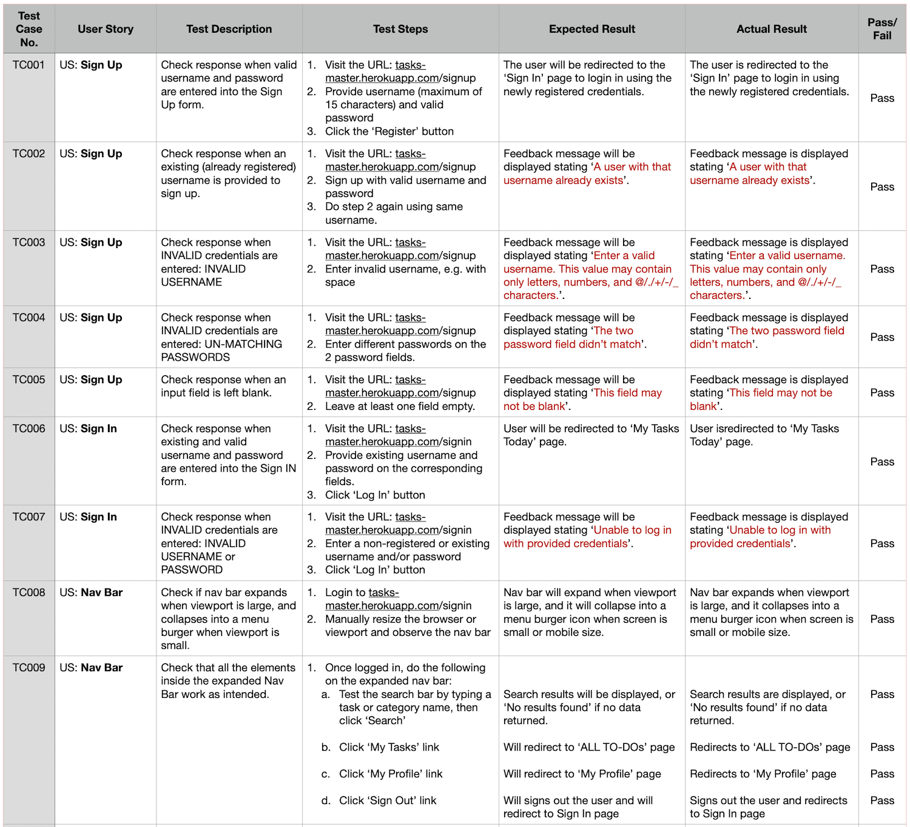   
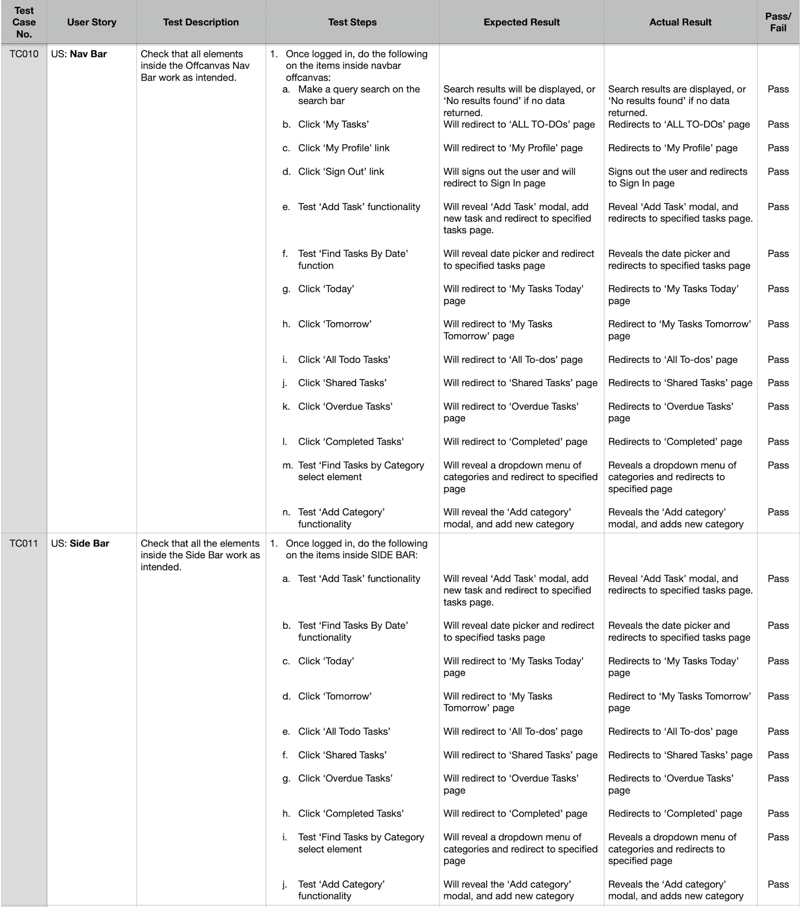   
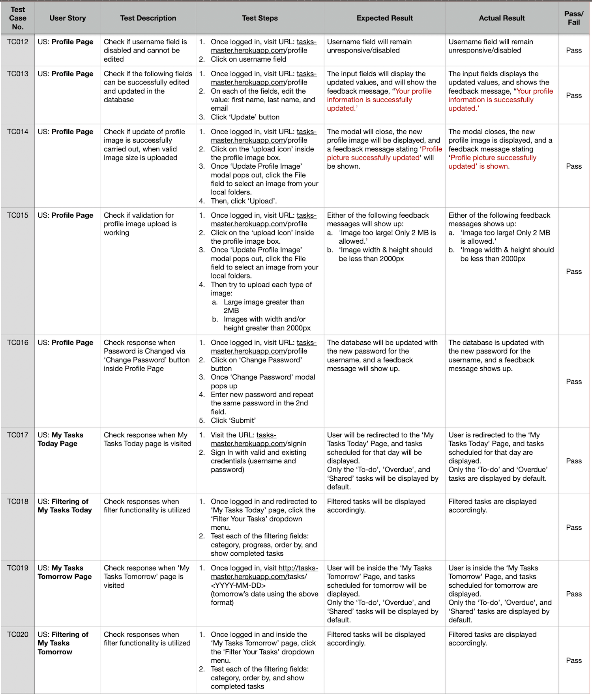   
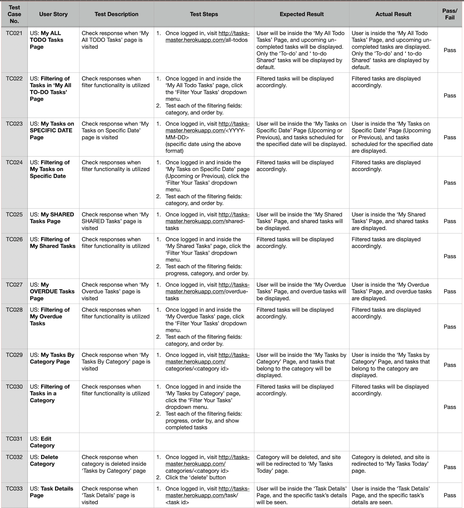   
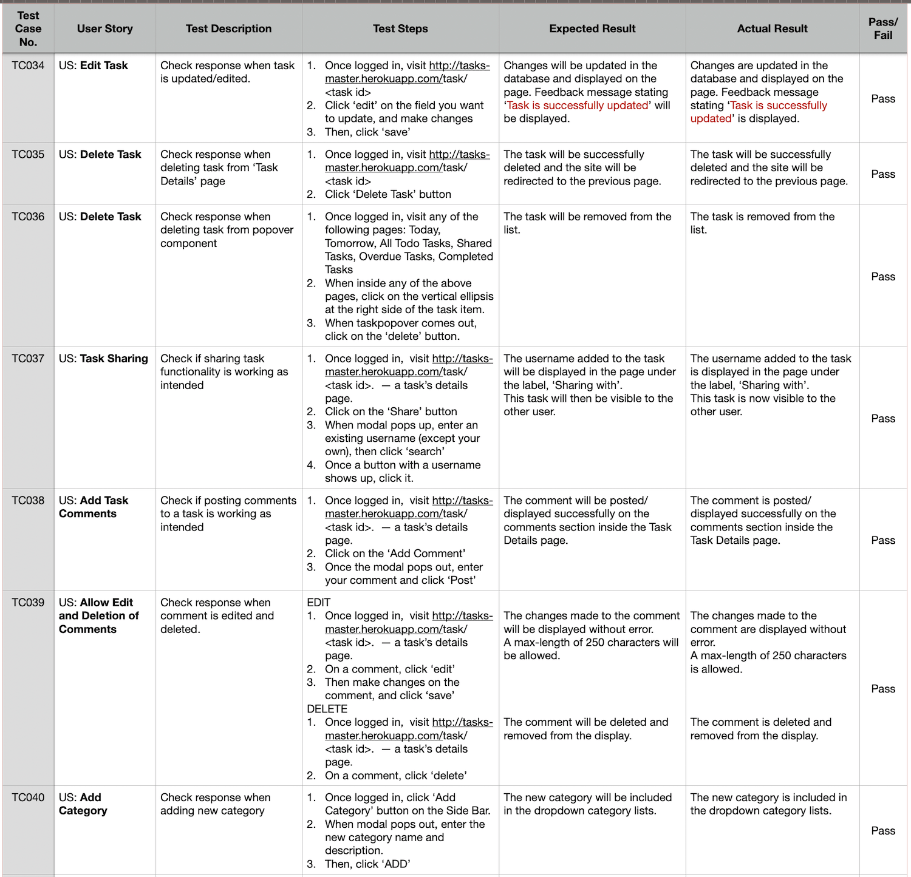   
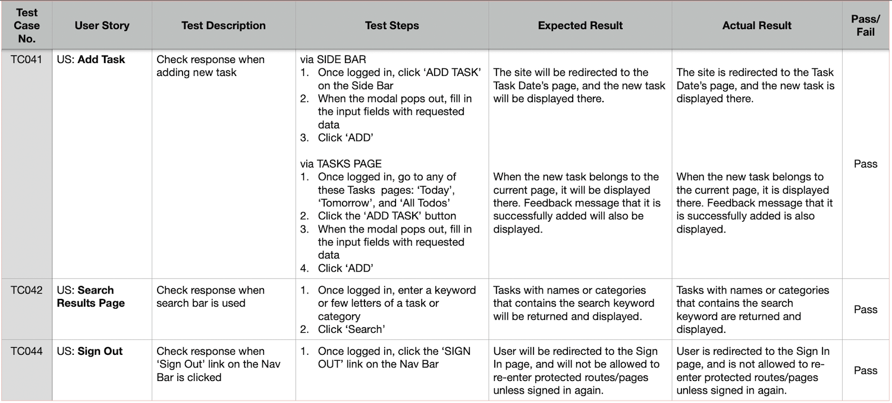   

## ESLint
To ensure that the Javascript code in this project follows standard and is clean the [ESLint](https://eslint.org/) was installed and utilized. And all issued raised by the eslint were fixed.

## Validators 

* **W3C CSS Validator**   
All CSS files on this project were validated by [W3C Validation Service](https://jigsaw.w3.org/css-validator/), and all results showed "**NO ERROR FOUND**".

  

* **WAVE - Web Accessibility Evaluation Tool**    
  This project utilised the [WAVE - Web Accessibility Evaluation Tool](https://wave.webaim.org/) browser extension to ensure its accessibility.   
  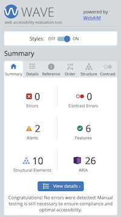

## Lighthouse Testing
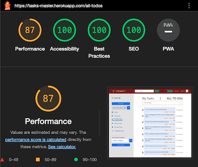
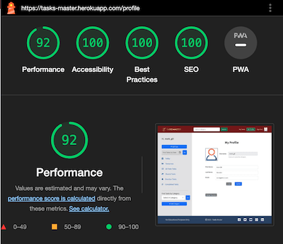

## Responsiveness

The responsiveness of this application has been testing on the **Chrome Developer tools**. And this site was designed to be responsive down to the smallest screen of **320px**.
* Chrome Developer Tools    
  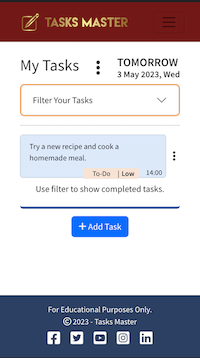
  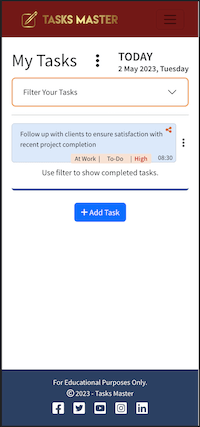   
